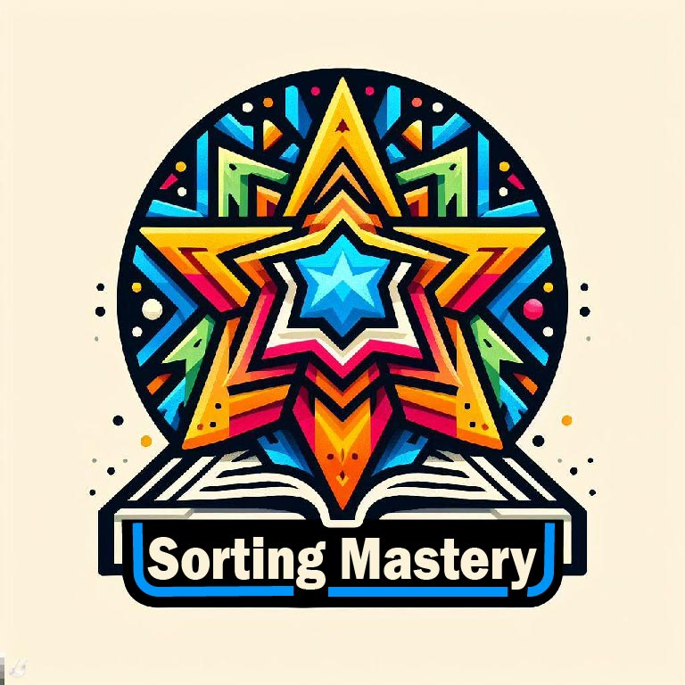

#Sorting Mastery: A Strategy Design Pattern Showcase



## Overview

_Sorting Mastery_ is a C++ project that showcases the elegance of various sorting algorithms through a strategy design pattern. The project was meticulously crafted for the course IT300 Design and Analysis of Algorithms at National Institute of Technology Karnataka, Surathkal. The entire implementation is encapsulated in a single main.cpp file, promoting simplicity and ease of understanding.

## Topics

- 
- 
- 
- 
- 
- 

## Project Highlights

- **Strategy Design Pattern:** The project leverages the Strategy Pattern, encapsulating sorting algorithms within distinct classes that inherit from the SortStrategy base class. This design fosters flexibility, allowing dynamic strategy selection at runtime.

- **Comprehensive Sorting Algorithms:** Sorting algorithms such as Insertion Sort, Selection Sort, Bubble Sort, Merge Sort, and Quick Sort are meticulously implemented, providing a comprehensive view of different sorting strategies.

- **Benchmarking Excellence:** Through a benchmarking approach, the project meticulously measures and compares the average execution time of each sorting algorithm. The results offer insights into the efficiency of these strategies for real-world applications.

## How to Experience Sorting Mastery

1. **Clone the Repository:**

   ```bash
   git clone https://github.com/your-username/sorting-mastery.git
   ```

2. **Compile and Run:**

   ```bash
   g++ main.cpp -o sorting_mastery
   ./sorting_mastery
   ```

3. **Explore Sorting Strategies:**

   Dive into the code to witness the power of strategy design pattern in action. Each sorting algorithm is encapsulated, allowing for easy comprehension and potential expansion.

4. **Benchmarking Insights:**

   Observe the benchmark results, gaining valuable insights into the performance of each sorting strategy. Use this knowledge to make informed decisions in your own projects.

## Contributions and Feedback

Feel inspired? Contribute enhancements, report issues, or share your thoughts on improving Sorting Mastery. Your engagement is welcomed and encouraged!

Let the journey into the world of sorting algorithms begin with Sorting Mastery!
